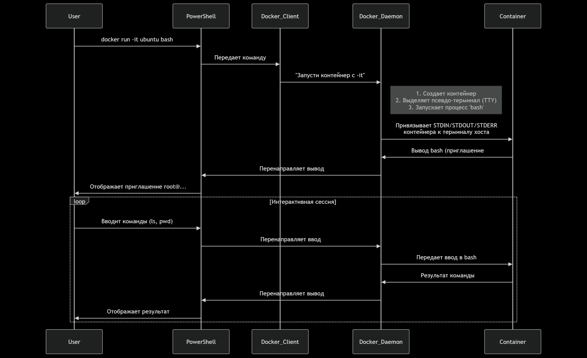

### Разбор команды: `docker run -it ubuntu bash`

*   `docker run`: Команда для создания и запуска нового контейнера.
*   `ubuntu`: Имя образа, на основе которого будет создан контейнер. Docker сначала ищет его локально, а если не находит — скачивает из DockerHub.
*   `bash`: Команда, которая будет выполнена внутри контейнера сразу после его запуска. В данном случае это запуск интерактивной командной оболочки Bash.
*   **Ключевые флаги `-it`:**
    *   `-i` (`--interactive`): Запускает контейнер в **интерактивном режиме**. Это означает, что стандартный вход (`stdin`) контейнера остается открытым, и Вы можете передавать ему данные (т.е. вводить команды).
    *   `-t` (`--tty`): Выделяет для контейнера **псевдо-терминал (PTY)**. PTY — это устройство, которое эмулирует текстовый терминал внутри вашей системы.

**Вместе `-it` создают эффект полного подключения вашего терминала к интерактивной сессии внутри контейнера.**

*Последовательность запуска контейнера*

